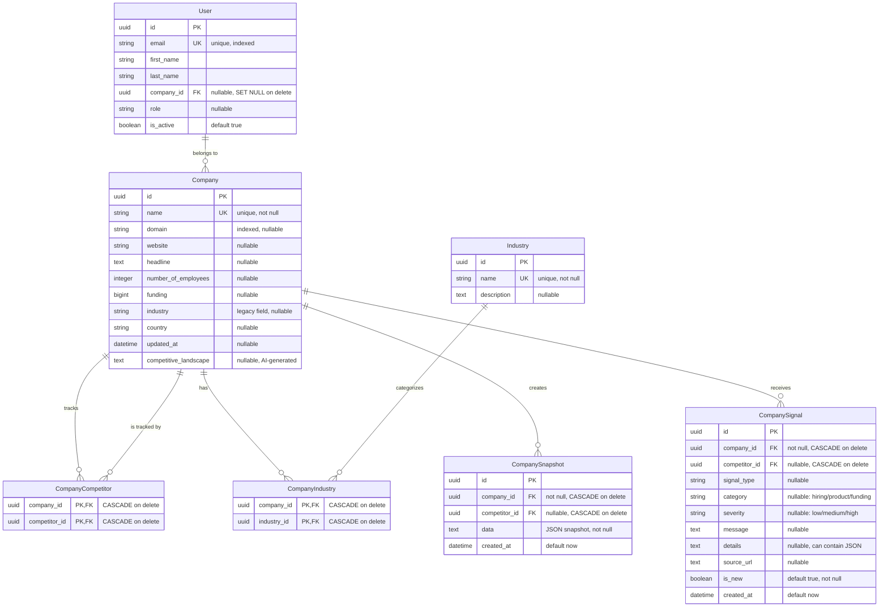

# Database ERD - Rival MVP

## Entity Relationship Diagram

## Relationships

### One-to-Many
- **User → Company**: Many users can belong to one company (via `company_id`). On company delete, user's `company_id` is set to NULL.
- **Company → CompanySnapshot**: One company creates many snapshots (for tracking competitors). Snapshots are CASCADE deleted.
- **Company → CompanySignal**: One company receives many signals (about competitors). Signals are CASCADE deleted.

### Many-to-Many
- **Company ↔ Company** (via `CompanyCompetitor`): Companies can track multiple competitors. Composite primary key prevents duplicates. CASCADE delete on both sides.
- **Company ↔ Industry** (via `CompanyIndustry`): Companies can belong to multiple industries. Composite primary key prevents duplicates. CASCADE delete on both sides.

## Key Constraints

1. **User.email**: Unique constraint with index for fast lookups
2. **Company.name**: Unique constraint (enforced at application level, should be in migration)
3. **CompanyCompetitor**: Composite primary key ensures no duplicate competitor relationships
4. **CompanyIndustry**: Composite primary key ensures no duplicate industry assignments
5. **CompanySnapshot.competitor_id**: Must be NULL or reference a different company (enforced in application logic)
6. **CompanySignal.competitor_id**: Must be NOT NULL for all signals (enforced in application logic - signals only for competitors)

## Important Notes

- **Self-referential Company**: The `Company` table is self-referential. A company can be both the "main company" (tracking others) and a "competitor" (tracked by others).
- **Signals are competitor-only**: Application logic ensures `CompanySignal.competitor_id` is always set and never equals `company_id`.
- **Snapshots are competitor-only**: Application logic ensures snapshots are only created for competitors, not the main company.
- **UUID Primary Keys**: All tables use UUID primary keys for better distributed system compatibility.
- **CASCADE Deletes**: Most relationships use CASCADE delete to maintain referential integrity, except User.company_id which uses SET NULL.

## Database Schema Version

This ERD reflects the schema after all migrations:
- Initial schema (363988352f18)
- Market positioning model (45cc21d58f5e) - *Note: This model may have been removed*
- Competitive landscape field (61fab210d9c4)
- CompanySnapshot and CompanySignal tables (6f3c2e280fce)
- Competitor ID and is_new fields (bfbbf2ab4fb7)
